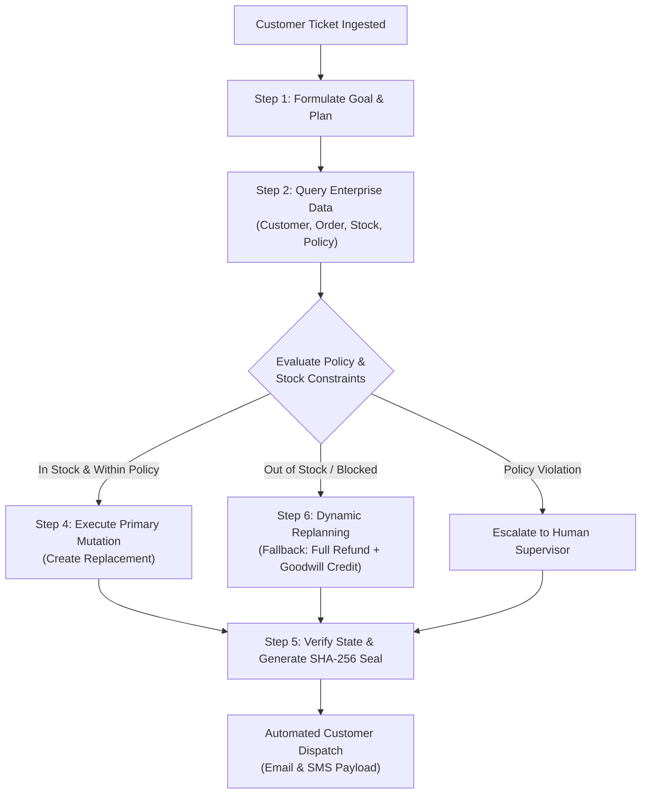

# 🤖 ResolveFlow — Autonomous Customer Resolution & Dynamic Re-planning Engine

[](file:///Users/hemanthkattamuri/Documents/resolveflow/backend/test_resolveflow.py)
[](https://python.org)
[](https://fastapi.tiangolo.com)
[](https://sqlite.org)
[]()
[]()

> **ResolveFlow** is an enterprise-grade autonomous AI customer resolution agent that executes end-to-end multi-step issue investigations, enforces return/replacement policies, handles out-of-stock replanning, mutates database records across 11 simulated enterprise tools, and provides certified cryptographic SHA-256 ledger seals.

---

## 📑 Table of Contents
- [🌟 Key Innovations](#-key-innovations)
- [🔄 How ResolveFlow Works (End-to-End ReAct Engine)](#-how-resolveflow-works-end-to-end-react-engine)
- [🖥️ Modern Web Interface & Interactive Modules](#️-modern-web-interface--interactive-modules)
- [🛠️ 11 Enterprise Simulated Tools](#️-11-enterprise-simulated-tools)
- [📊 4 Benchmark Enterprise Scenarios](#-4-benchmark-enterprise-scenarios)
- [🔐 Cryptographic Verification & Tamper Detection](#-cryptographic-verification--tamper-detection)
- [🚀 Quick Start & Installation](#-quick-start--installation)
- [🧪 Automated Test Suite](#-automated-test-suite)
- [🏛️ System Architecture & File Structure](#️-system-architecture--file-structure)
- [📦 Push to GitHub](#-push-to-github)

---

## 🌟 Key Innovations

1. **Autonomous ReAct Deliberation Loop**: The agent reasons dynamically through **Thought**, **Tool Call**, and **Observation** steps before mutating enterprise state.
2. **Dynamic Replanning on Failure**: When an initial resolution is blocked (e.g., warehouse inventory is depleted), the agent automatically diagnoses the failure, replans a secondary remedy (such as a 100% refund + goodwill store credit), and executes it without human stall.
3. **Relational SQLite State Mutation**: Performs real database inserts and updates across orders, replacements, refunds, inventory, and ledger history.
4. **Cryptographic SHA-256 Ledger Seals**: Asserts state change validity with an immutable hash seal calculated over the ticket, action, order, and timestamp.
5. **Interactive Policy & Inventory Sandbox**: Tweak live inventory stock and policy windows in real-time to watch the agent adapt its reasoning on the fly.
6. **Starting Security Gateway**: Features a canvas-rendered 3D Animated Neural Core with elastic attachment filaments and operator authentication.

---

## 🔄 How ResolveFlow Works (End-to-End ReAct Engine)



### The 6-Stage Resolution Progression:
1. **Goal Formulation**: Deconstructs customer issue and sets explicit success criteria.
2. **Enterprise Data Ingestion**: Gathers verified records across orders, shipping logs, inventory SKUs, and warranty windows.
3. **Decision & Policy Evaluation**: Checks return eligibility windows (e.g. 30 days) and customer tier rules (Standard vs. VIP).
4. **State Mutation**: Performs atomic database write actions (ship replacement, refund payment, restock items).
5. **State Verification & Sealing**: Queries the SQLite database to confirm mutations succeeded, then computes a cryptographic SHA-256 verification hash.
6. **Dynamic Replanning (Fallback Path)**: If any tool returns an error or inventory shortage, the agent pivots to secondary remedies.

---

## 🖥️ Modern Web Interface & Interactive Modules

### 🎨 Modern Light & Dark Design System
- **Polished Card Aesthetics**: Layered soft shadows, rounded borders (`18px`–`24px`), and subtle gradient mesh backdrops.
- **Strict High-Contrast Button Hierarchy**:
  - 🔵 **Primary (`.btn-primary`)**: Bright Blue/Purple gradient for core execution (`#4f46e5` → `#7c3aed`).
  - 🟢 **Success (`.btn-success`)**: Emerald Green gradient for verification proofs (`#10b981` → `#059669`).
  - 🟠 **Warning (`.btn-warning`)**: Amber/Orange gradient for sandbox tweaks & tamper tests (`#f59e0b` → `#d97706`).
  - 🔴 **Destructive (`.btn-danger`)**: High-contrast Red/Rose gradient for database reset (`#ef4444` → `#dc2626`).
  - 🔷 **Cyan (`.btn-cyan`)**: Electric Cyan gradient for audit drawers (`#06b6d4` → `#0284c7`).
  - ⚪ **Secondary (`.btn-secondary`)**: Clean white cards with gentle hover lift.

### 🎛️ Interactive Platform Modules:
- **Operator Security Gateway**: Role-based simulated authentication with a 3D canvas neural core and smooth filament animations.
- **Real-Time Step-by-Step Timeline**: Color-coded borders indicating step categories (`GOAL`, `TOOL_CALL`, `OBSERVATION`, `DECISION`, `ACTION`, `REPLANNING`, `VERIFICATION`) with expandable raw payload inspectors.
- **Database Inspector Modal**: Tabbed view of SQLite database tables (`Inventory`, `Orders`, `Replacements`, `Refunds`, `Store Credits`, `Ledger`).
- **Policy & Inventory Sandbox**: Sliders and counters allowing operators to adjust warehouse stock or return policy timeframes live.
- **Cryptographic Proof Modal**: Real-time SHA-256 verification with a simulated "Tamper Ledger" button to verify audit safety.
- **Tools Audit Log Drawer**: Full chronological JSON event log of every tool execution.
- **Execution Speed Control**: Switch between *Instant*, *Normal* (0.4s delay), and *Presentation* (0.9s delay).

---

## 🛠️ 11 Enterprise Simulated Tools

| # | Tool Name | Parameters | Description |
|---|---|---|---|
| 1 | `get_customer` | `customer_id` | Retrieves customer profile, tier (Standard/VIP), and lifetime value. |
| 2 | `get_order` | `order_id` | Fetches line items, shipping status, tracking numbers, and delivery date. |
| 3 | `get_inventory` | `sku` | Checks live stock levels and warehouse location. |
| 4 | `search_policy` | `issue_type, order_id` | Evaluates enterprise policy eligibility windows and maximum refund caps. |
| 5 | `get_customer_history` | `customer_id` | Queries previous ticket history and account risk flags. |
| 6 | `create_replacement` | `order_id, sku, address` | Generates a replacement order with zero balance and decrements stock. |
| 7 | `issue_refund` | `order_id, amount, reason` | Processes payment refunds via simulated gateway. |
| 8 | `cancel_order` | `order_id, reason` | Cancels unfulfilled orders and restocks reserved units. |
| 9 | `create_store_credit` | `customer_id, amount, reason` | Issues promo or goodwill credit balances directly to customer accounts. |
| 10 | `verify_resolution` | `ticket_id, action, metadata` | Verifies database integrity and calculates a SHA-256 proof seal. |
| 11 | `escalate_to_human` | `ticket_id, reason, priority` | Flags edge cases and policy violations to Tier 2 human supervisors. |

---

## 📊 4 Benchmark Enterprise Scenarios

1. **Scenario 1 (`TCK-1042`) — Defective Item (Primary Replacement Path)**:
   - *Customer*: Sarah Jenkins (VIP).
   - *Issue*: UltraSound Headphones arrived defective.
   - *Agent Action*: Checks stock (14 units available) → verifies 30-day warranty → creates express replacement shipment.
2. **Scenario 2 (`TCK-2089`) — Damaged Goods with Zero Inventory (Dynamic Replanning Path)**:
   - *Customer*: Marcus Vance (Standard).
   - *Issue*: 4K Gaming Monitor arrived cracked.
   - *Agent Action*: Attempts replacement → discovers inventory is 0 → **dynamically replans** → issues 100% refund ($499.99) + $25 goodwill store credit.
3. **Scenario 3 (`TCK-3341`) — Out of Policy Return Request (Guardrail Escalation)**:
   - *Customer*: Elena Rostova (Standard).
   - *Issue*: Requesting return on item delivered 48 days ago (policy max is 30 days).
   - *Agent Action*: Policy check flags violation → safely rejects automated refund → escalates ticket to human supervisor.
4. **Scenario 4 (`TCK-4510`) — Pre-Shipment Cancellation (Order Cancellation Path)**:
   - *Customer*: David Chen (VIP).
   - *Issue*: Accidental duplicate purchase still in processing status.
   - *Agent Action*: Verifies processing status → cancels order → restocks unit → refunds $89.00 payment.

---

## 🔐 Cryptographic Verification & Tamper Detection

Every completed ticket generates an immutable SHA-256 verification hash seal:
```python
seal_payload = f"{ticket_id}:{action_type}:{order_id}:{target_amount}:{timestamp}:{SALT}"
sha256_hash = hashlib.sha256(seal_payload.encode()).hexdigest()
```

If an operator uses the **Test Tamper** button in the UI, the cryptographic assertion fails immediately, alerting the auditor to unauthorized state changes.

---

## 🚀 Quick Start & Installation

### Prerequisites
- Python 3.10+
- Modern Web Browser (Chrome, Safari, Firefox, Edge)

### 1-Command All-in-One Launch (Recommended)
```bash
./run.sh
```
*Automatically sets up Python virtual environment, installs backend dependencies, initializes the SQLite database, and starts both backend and frontend servers!*

- **Frontend Station**: `http://localhost:5173` (or open `index.html` directly)
- **Backend API**: `http://127.0.0.1:8000`
- **Interactive Swagger API Docs**: `http://127.0.0.1:8000/docs`

---

### Manual Step-by-Step Setup

#### 1. Setup Backend Environment
```bash
python3 -m venv .venv
source .venv/bin/activate
pip install -r backend/requirements.txt
python backend/seed.py
uvicorn backend.main:app --host 127.0.0.1 --port 8000 --reload
```

#### 2. Launch Frontend
```bash
python3 -m http.server 5173
```
Open `http://localhost:5173` in your browser.

---

## 🧪 Automated Test Suite

Run the comprehensive pytest suite verifying all 11 enterprise tools, ReAct loop reasoning, inventory replanning fallbacks, and policy escalation guardrails:

```bash
./.venv/bin/pytest backend/test_resolveflow.py -v
```

**Expected Output:**
```
backend/test_resolveflow.py::test_tools_inspection PASSED                [ 16%]
backend/test_resolveflow.py::test_inventory_failure_and_replanning_action PASSED [ 33%]
backend/test_resolveflow.py::test_scenario_1_replacement_flow PASSED     [ 50%]
backend/test_resolveflow.py::test_scenario_2_replanning_flow PASSED      [ 66%]
backend/test_resolveflow.py::test_scenario_3_policy_escalation_flow PASSED [ 83%]
backend/test_resolveflow.py::test_scenario_4_cancellation_flow PASSED    [100%]

============================== 6 passed in 0.14s ===============================
```

---

## 🏛️ System Architecture & File Structure

```
resolveflow/
├── backend/
│   ├── __init__.py
│   ├── database.py         # SQLite schema & foreign key connections (11 tables)
│   ├── tools.py            # 11 simulated enterprise tools with latency simulation
│   ├── agent_engine.py     # ReAct reasoning engine, tool dispatcher, SSE event generator
│   ├── models.py           # Pydantic data validation schemas
│   ├── seed.py             # 4 benchmark test scenarios & enterprise sample data
│   ├── main.py             # FastAPI REST endpoints & SSE streaming router
│   └── test_resolveflow.py # Automated pytest verification suite (6/6 tests passing)
├── index.html              # Standalone Single-Page Application (HTML/CSS/JS)
├── run.sh                  # One-click launch script
├── .gitignore              # Git ignore rules for venv, cache, and db files
└── README.md               # Complete project documentation & guide
```

---

## 📦 Push to GitHub

To push the latest updates to your GitHub repository:

```bash
cd /Users/hemanthkattamuri/Documents/resolveflow

# 1. Stage all changes
git add .

# 2. Commit with descriptive message
git commit -m "docs: update comprehensive README with architecture, ReAct flow, and tool specs"

# 3. Push to GitHub
git push origin main
```

---

## ⚖️ License & Acknowledgments
Developed for **Track 3 (Smart Automation) — Problem Statement 5: Autonomous Customer Resolution Agent**. Built with FastAPI, SQLite, and vanilla CSS/JS.
